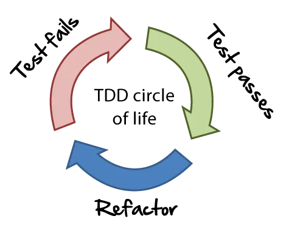

# Introducción al Test Driven Development (TDD)

[](https://wakatime.com/badge/user/8ef73281-6d0a-4758-af11-fd880ca3009c/project/126bf05d-d2ee-4002-8626-911bf861ccd1)

## ¿Qué es y por qué usar TDD?

El Desarrollo Guiado por Pruebas (TDD por sus siglas en inglés), es una forma de desarrollar código, en el cual los test son escritos primero y entonce el código se construye para que el test pueda pasar.

El TDD se conforma de 3 pasos:

- Test fallidos
- Test pasados
- Refactorización



Básicamente podemos decir que:

1. Se escribe un test y se encuentra que ha fallado
2. Se implementa el código necesario para que el test pase
3. Se refactorea el código para que sea más limpio y eficiente
4. Se repite el ciclo para cada función o método que se quiera implementar.

## Preparación del entorno

Nuestro primer paso será crear el proyecto, y para ello podemos crear el archivo `package.json` de forma manual, o, utilizar el siguiente comando que lo crea por nosotros con la estructura básica:

```bash
npm init -y
```

En nuestro ejemplo solo necesitaremos la instalación de dependencias para el modo de desarrollo, dado que el plan de TDD es ir implementando a medida que desarrollamos el código.

```bash
pnpm install --save-dev jest
```

Por último, configuramos los scripts para ejecutar el proyecto desde consola (`start`), y para correr los test (`test`):

```json
{
    ...
    "main": "src/index.js",
    ...
    "scripts": {
        "start": "node src/index.js",
        "test": "npx jest"
    },
    ...
}
```

## Vamos con el ejemplo

El siguiente ejemplo será algo pequeño pero que nos servirá para entender cómo ir aplicando el TDD, el cual nos ayuda a construir el juego de manera incremental, e incluso cómo nuestros inputs pueden interactuar con la aplicación.

***Descripción:*** El programa genera un número aleatorio entre 1 y 100. El jugador intenta adivinarlo, y el programa responde con mensajes según la comparación.

### Paso 1: Crear el esqueleto del código principal

```js
class GuessingGame {
    /**
     * El constructor define cual sería el número objetivo el cual es 
     * generado de manera aleatoria
     */
    constructor () {
        this.target = this.generateNumber();
    }

    /**
     * @returns: Un número aleatorio entre 1 y 100 
     */
    generateNumber () { }

    /**
     * @param number: El número que el usuario ingresa 
     * @returns: Indica si el número del usuario es más alto, más bajo 
     * o es igual al número aleatorio del programa
     */
    guess (number) { }
}

module.exports = GuessingGame;
```

### Paso 2: Definir el suit de los tests

La primera parte es definir el scope teórico de las pruebas, es decir, delimitar de manera textual un set de n pruebas:

```js
const GuessingGame = require("../src");

describe("Juego de Adivinanza de Números", () => {
    //...
});
```

### Paso 3: Crear los test de los casos posibles

Nuestro siguiente objetivo es definir los test mediante los cuales vamos a validar que el output sea lo que esperamos, debemos tener en cuenta que se deben encontrar dentro del cuerpo de la función anónima del método `describe` que recibe en su segundo parámetro:

1. Validar que el número aleatorio se genere en el rango correcto:

   ```js
   describe("Juego de Adivinanza de Números", () => {
       it("Debe generar un número entre 1 y 100", () => {
           const game = new GuessingGame();
           const number = game.generateNumber();

           expect(number).toBeGreaterThanOrEqual(1);
           expect(number).toBeLessThanOrEqual(100);
       });
   });
   ```

2. Responder con el mensaje adecuado según cada caso:

   ```js
   describe("Juego de Adivinanza de Números", () => {
       it("Debe responder 'muy alto' si la adivinanza es mayor al número objetivo", () => {
           const game = new GuessingGame();
           game.target = 50;

           expect(game.guess(60)).toBe("muy alto");
       });
   });
   ```

   ```js
   describe("Juego de Adivinanza de Números", () => {
       it("Debe responder 'muy bajo' si la adivinanza es menor al objetivo", () => {
           const game = new GuessingGame();
           game.target = 50;

           expect(game.guess(30)).toBe("muy bajo");
       })
   });
   ```

   ```js
   describe("Juego de Adivinanza de Números", () => {
       it("Debe responder 'correcto' si la adivinanza coincide con el objetivo", () => {
           const game = new GuessingGame();
           game.target = 50;

           expect(game.guess(50)).toBe("correcto");
       });
   });
   ```

Cuando ejecutamos los test con el comando `npm run test`, vamos a observar cómo fallan las pruebas y analizar los resultados, en este caso, los valores en verde representan los valores recibidos, mientras que el color rojo se asigna a la respuesta del código testeado.

### Paso 4: Optimizar el código de los test

Si revisamos los test, en cada uno de ellos vamos a crear una instancia de la clase `GuessingGame`, y luego forzamos el número objetivo en los últimos 3 test. Dado que es código que se repite en cada prueba, podemos usar la función `beforeEach` y establecer algunas acciones que se deben ejecutar antes de cada prueba, mejorando así la **Legibilidad** y **Mantenibilidad** del script de test.

Por ejemplo, así se verá el código mejorado con los 2 primeros test:

```js
describe("Juego de Adivinanza de Números", () => {
    let game;

    beforeEach(() => {
        game = new GuessingGame();
        game.target = 50;
    });

    it("Debe generar un número entre 1 y 100", () => {
        const number = game.generateNumber();

        expect(number).toBeGreaterThanOrEqual(1);
        expect(number).toBeLessThanOrEqual(100);
    });

    it("Debe responder 'muy alto' si la adivinanza es mayor al número objetivo", () => {
        expect(game.guess(60)).toBe("muy alto");
    });
    ...
});
```

### Paso 5: Implementación gradual

Para implementar la clase `GuessingGame` de manera gradual, podemos comenzar a definir las acciones del método `generateNumber()`, y que deben cumplir con el requerimiento del primer test definido:

```js
class GuessingGame {
    ...
    generateNumber () {
        return Math.floor(Math.random() * 100) + 1;
    }
}
```

Cuando volvemos a correr los test, podemos observar que hemos logrado pasar el primer test, pero aún fallan los otros 3, por lo tanto, seguimos con el código.

El siguiente paso es definir el comportamiento de la función `guess`. Dado que es un ejemplo simple, podemos establecer todos los caminos de los condicionales, pero en algunos casos de prueba se nos puede presentar la situación de que debemos crear el código para pasar diferentes test que añaden funcionalidades diferentes al mismo método.

```js
class GuessingGame {
    ...
    guess (number) {
        if (number < this.target) return "muy bajo";
        else if (number > this.target) return "muy alto";
        return "correcto";
    }
}
```

Al momento de ejecutar el test suit, observamos que todos los test han pasado correctamente.

### Paso 6: Refactorizar

En este punto podemos volver a leer nuestro código y analizar se podemos aplicar mejoras, por ejemplo:

- Creación de métodos y atributos privados
- Mejorar o añadir comentarios para los métodos o líneas especificas del código
- Mejorar la extensibilidad de la clase para incluir nuevos rangos o lógicas personalizadas.

### Extra: Interactividad con Node.js

En este bonus quiero utilizar el módulo `readline` para que el usuario pueda interactuar con el juego:

```js
const readline = require('readline');

class GuessingGame {
    ...
    play () {
        const rl = readline.createInterface({
            input: process.stdin,
            output: process.stdout,
        });

        console.log("¡Bienvenido al Juego de Adivinanza de Números!");
        console.log("Adivina ún número entre 1 y 100");

        const ask = () => {
            rl.question('¿Cuál es tu número?', (input) => {
                const guess = parseInt(input, 10);

                if (isNaN(guess)) {
                    console.log("Por favor, ingresa un número válido.");
                    ask();
                    return;
                }

                const response = game.guess(guess);
                console.log(response);

                if (response === 'correcto') {
                    console.log("¡Felicidades, ganaste!");
                    rl.close();
                } else {
                    ask();
                }
            });
        };

        ask();
    }
}

module.exports = GuessingGame;


const game = new GuessingGame();
game.play();
```

Aquí surge una actividad: **¡Apliquemos TDD!**. Claro, este ejemplo es solo algo introductorio, pero si hubiésemos aplicado TDD antes de desarrollar esta funcionalidad bonus, tendríamos algo similar a lo siguiente:

```js
describe("Avanzado - Interactividad con Node.js", () => {
    let game;
    let mockQuestion;
    let mockClose;

    beforeEach(() => {
        game = new GuessingGame();
        game.target = 50;

        mockQuestion = jest.fn();
        mockClose = jest.fn();

        jest.spyOn(require("readline"), "createInterface").mockReturnValue({
            question: mockQuestion,
            close: mockClose,
        });
    });

    afterEach(() => {
        jest.restoreAllMocks();
    });

    it("Debe iniciar el juego y responder 'correcto' cuando el usuario acierte", () => {
        mockQuestion.mockImplementationOnce((prompt, callback) => {
            expect(prompt).toBe("¿Cuál es tu número?");
            callback("50");
        });

        game.play();

        expect(mockQuestion).toHaveBeenCalled();
        expect(mockClose).toHaveBeenCalled();
    });

    it("Debe continuar preguntando cuando la entrada es inválida o incorrecta", () => {
        mockQuestion
            .mockImplementationOnce((prompt, callback) => callback("not a number"))
            .mockImplementationOnce((prompt, callback) => callback("30"))
            .mockImplementationOnce((prompt, callback) => callback("50"));

        game.play();

        expect(mockQuestion).toHaveBeenCalledTimes(3);
        expect(mockClose).toHaveBeenCalled();
    });
});
```

## Cierre y reflexión

En esta sesión, hemos explorado cómo el Desarrollo Guiado por Pruebas (TDD) puede transformar nuestra forma de programar y mejorar la calidad del código que escribimos. Para resumir, TDD nos ofrece los siguientes beneficios:

- *Pensar primero, codificar después*: Nos obliga a definir claramente los requisitos antes de escribir una sola línea de código. Esto nos ayuda a mantener el enfoque en lo que realmente importa.
- *Confianza en el código*: Tener un conjunto de pruebas confiables significa que siempre podemos verificar que nuestro programa funciona como se espera, incluso después de realizar cambios.
- *Documentación implícita*: Las pruebas no solo verifican, también sirven como una guía que explica cómo debería comportarse nuestro código, incluso en los casos más inusuales.

Además, hemos visto cómo TDD nos ayuda a entender y documentar comportamientos curiosos de JavaScript. Algunos de estos comportamientos pueden parecer extraños al principio, pero con la práctica y el uso de pruebas podemos convertirlos en oportunidades para aprender y mejorar nuestro código.

### Tarea para Reflexionar y Practicar

Tu misión es escribir pruebas para otros comportamientos curiosos de JavaScript que encuentres. Algunos puntos que puedes explorar:

- Operaciones inusuales con tipos de datos (+, -, comparaciones, coerciones).
- Casos que mezclen objetos y arrays en operaciones matemáticas o lógicas.
- Comportamientos inesperados al usar valores como null, undefined o NaN.

### Puntos Clave para Llevarse

- *JavaScript es poderoso, pero también flexible*: Esa flexibilidad es útil, pero puede generar errores si no tenemos cuidado.
- *Validar y convertir tipos*: Es una práctica esencial para prevenir comportamientos inesperados.
- *Curiosidad constante*: Explorar y documentar comportamientos curiosos con pruebas es una excelente forma de aprender y crecer como desarrolladores.

### Ejemplos adicionales

Para algunos ejemplos adicionales separados en dificultades, puedes consultar mi repositorio [Test Driven Development (TDD) con Mocha en Node con TS](https://github.com/carlos-paezf/Node-TS-TDD?tab=readme-ov-file).
